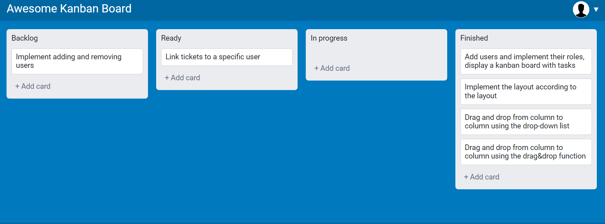
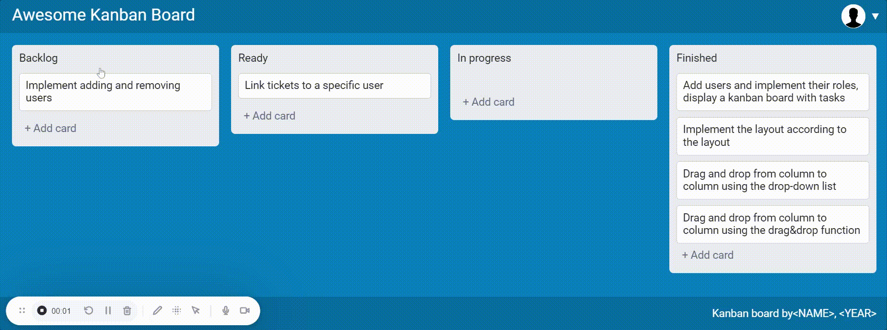

# Readme Kanban Board

## An example of how the application works

    <!---KANBAN
    # Backlog
    - Implement adding and removing users

    # Ready
    - Link tickets to a specific user

    # In progress
    -

    # Finished
    - Add users and implement their roles, display a kanban board with tasks
    - Implement the layout according to the layout
    - Drag and drop from column to column using the drop-down list
    - Drag and drop from column to column using the drag&drop function
    KANBAN--->

Which generates:





## Usage

Scripts for the package.json file:

    
```javascript
"scripts": {
        "start": "webpack serve --mode development --open",
        "build": "webpack --mode production"
    }
```


Then fire it up by running:

    npm run build
    npm run start

## Data for logging into your personal account

**User:**

- login: Vasya
- password: qwerty123

**Admin:**

- login: admin
- password: 123


